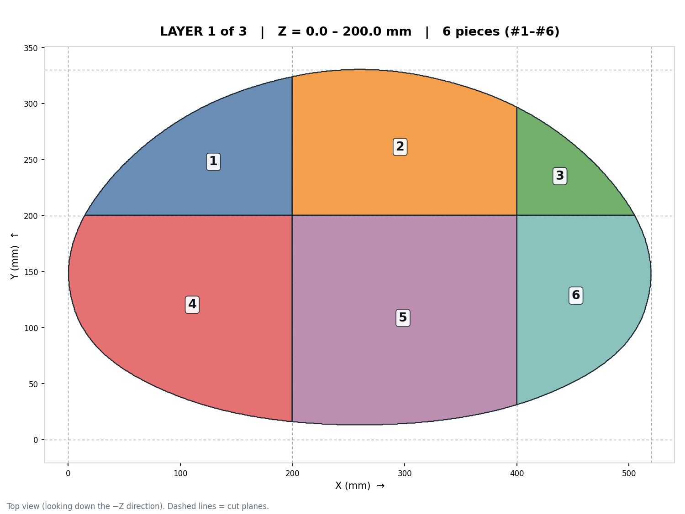
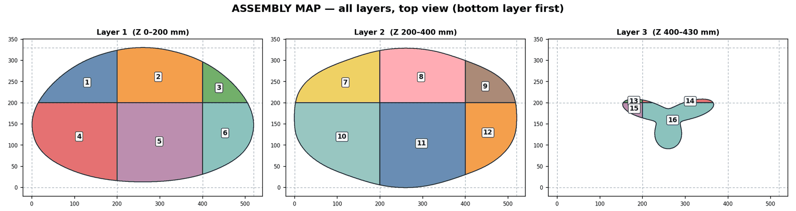
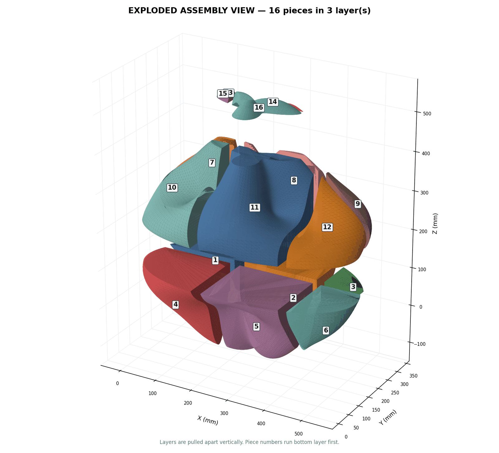

# 3D-GRID-SPLITTER

[](https://opensource.org/licenses/MIT)
[](https://www.python.org/downloads/)

**대형 3D 모델 격자 분할 도구 — Automated Grid Slicing Tool for Large 3D Models**

큰 3D 메시(`.stl`, `.obj`)를 지정한 크기(예: 200×200×200 mm)의 격자로 잘라
**방수(watertight)** 조각으로 저장한다. 절단면은 자동으로 막히므로 조각을
그대로 3D 프린팅하거나 개별 분석에 쓸 수 있다.

조각을 **숫자 파일명(`1.stl`, `2.stl`, …)** 으로 저장하고,
**각 조각이 어디에 있는지 보여주는 층별 지도**를 함께 만든다.

---

## 🚀 기능

| | |
|---|---|
| **격자 분할** | 모델을 X·Y·Z 크기(mm)로 잘라 N×M×L 조각 생성 |
| **자동 캡(capping)** | 절단면을 삼각분할로 막아 방수 메시 유지 |
| **법선 정리** | 절단 과정에서 뒤집힌 삼각형 방향을 자동으로 맞춤 (슬라이서 오류 방지) |
| **숫자 파일명** | `1.stl`, `2.stl`, `3.stl` … 통번호 |
| **층별 평면도** | `layer_01.png` … 각 층을 위에서 내려다본 도면 (실제 단면 모양 + 번호) |
| **전체 요약 도면** | `layers_overview.png` — 모든 층을 한 장에 |
| **3D 분해 조립도** | `exploded_3d.png` — 층을 벌려 놓은 입체 도면 |
| **조각 목록** | `index.csv` — 번호 / 층 / 행 / 열 / 좌표범위 / 면 개수 / 방수 여부 |
| **GUI + EXE** | 파이썬 없이 실행 가능한 Windows 프로그램으로 빌드 가능 |

### 결과 예시

520 × 330 × 430 mm 모델을 200 mm 격자로 자른 결과 — 16조각, 3층.

| 1층 평면도 | 전체 층 요약 |
|---|---|
|  |  |



`examples/` 폴더에 위 도면과 `index.csv` 가 들어 있다.

### 번호 매기는 순서

```
아래층(Z 작은 쪽)부터  →  각 층에서 도면 위쪽 행(Y 큰 쪽)부터  →  왼쪽 열(X 작은 쪽)부터
```

예) 1층에 6조각, 2층에 6조각, 3층에 4조각이면 → 1‑6번이 1층, 7‑12번이 2층, 13‑16번이 3층.
조립할 때 번호 순서대로 아래에서부터 쌓으면 된다.

---

## 📦 설치

```bash
git clone https://github.com/YEONCHEOL-HA/3D-GRID-SPLITER.git
cd 3D-GRID-SPLITER
pip install -r requirements.txt
```

`scipy` 는 선택 사항이다. 없으면 numpy 격자 해싱으로 자동 대체되며 결과는 동일하다.

---

## 🖥 GUI 로 쓰기

```bash
python gui.py
```

입력 모델과 저장 폴더를 고르고 절단 크기를 입력한 뒤 **자르기 시작**을 누른다.
모델을 선택하면 크기와 예상 조각 수(`격자 3열 × 2행 × 3층 → 최대 18조각`)가 미리 표시된다.

`run_gui.bat` 을 더블클릭해도 된다. Python 이 없으면 알아서 설치한 뒤 GUI 를 띄운다.

### EXE 만들기 (Windows)

`build_exe.bat` 을 더블클릭하면 끝이다. Python 이 없으면 **자동으로 설치한다.**

1. `py -3` → `python` → 표준 설치 폴더 순서로 진짜 Python 을 찾는다.
   Windows 에 기본으로 들어 있는 `python.exe` 는 실제 파이썬이 아니라 Microsoft Store 로
   연결되는 바로가기(앱 실행 별칭)이므로 걸러낸다.
2. 못 찾으면 `winget install -e --id Python.Python.3.13` 을 시도한다.
3. winget 도 없으면 python.org 에서 설치 파일(약 30MB)을 내려받아 조용히 설치한다.
   `InstallAllUsers=0 PrependPath=1` — **사용자 계정에만 설치하므로 관리자 권한이 필요 없다.**
4. 그 뒤 numpy·matplotlib·pyinstaller 를 설치하고 빌드한다.

```
dist\3D-GRID-SPLITTER.exe
```

설치 판단 로직은 `_python_setup.bat` 에 따로 들어 있고 두 배치가 공용으로 쓴다.
세 파일(`build_exe.bat`, `run_gui.bat`, `_python_setup.bat`)은 같은 폴더에 있어야 한다.
이미 Python 이 있는데 자동 설치를 막고 싶으면 `set PYSETUP_NOINSTALL=1` 후 실행한다.

* `SLIM=1` (기본값) — scipy 를 빼서 용량을 줄인다. 기능 차이 없음.
* `ONEFILE=1` (기본값) — exe 파일 하나로 배포. `0` 으로 바꾸면 폴더 배포(실행이 빠름).

## ⌨️ 명령줄로 쓰기

```bash
python grid_splitter.py model.stl -o pieces -x 200 -y 200 -z 200
```

| 옵션 | 설명 |
|---|---|
| `-o` | 저장 폴더 (기본 `pieces`) |
| `-x -y -z` | 절단 크기 mm (기본 200) |
| `-f stl\|obj` | 저장 형식 |
| `--no-repair` | 원본 구멍 메우기 끄기 |
| `--no-fix-normals` | 법선 방향 자동 정리 끄기 |
| `--no-maps` | 지도 생성 끄기 |
| `--no-exploded` | 3D 조립도만 끄기 |
| `--explode 0.4` | 3D 조립도에서 조각을 벌리는 정도 |
| `--zip` | 결과를 `pieces.zip` 으로 묶기 |

## 🐍 파이썬에서 쓰기

```python
import grid_splitter as gs

res = gs.run_split("model.stl", "pieces",
                   cut_x=200, cut_y=200, cut_z=200,
                   layer_maps=True, exploded_map=True)

for p in res["pieces"]:
    print(p["num"], p["layer"], p["row"], p["col"], p["file"])
```

---

## 📂 출력 예시

```
pieces/
├── 1.stl  2.stl  3.stl  …  16.stl
├── index.csv
├── layer_01.png        ← 1층 평면도
├── layer_02.png        ← 2층 평면도
├── layer_03.png        ← 3층 평면도
├── layers_overview.png ← 전체 층 요약
└── exploded_3d.png     ← 3D 분해 조립도
```

평면도에는 각 조각의 **실제 단면 모양**이 색으로 채워지고, 점선은 절단면,
숫자는 조각 번호다. 위에서 내려다본 방향(−Z)이며 X 는 오른쪽, Y 는 위쪽이다.

---

## 📝 참고

* 배치 스크립트의 Python 탐지·설치 분기는 Wine 의 cmd 로 7가지 상황(py 런처 있음/없음,
  Store 별칭만 있음, `C:\PythonXXX`, `Program Files`, 사용자 폴더 설치, 아무것도 없음)을
  실행해 확인했다.
* `grid cut.py` 는 원본 Colab 스크립트로, 기록용으로 남겨 두었다.
  새 작업에는 `grid_splitter.py` / `gui.py` 를 쓴다.
* 면이 수백만 개인 스캔 모델은 분할에 수 분~수십 분이 걸릴 수 있다.
  먼저 큰 절단 크기로 시험해 보고 값을 조정하는 것을 권한다.
* 지도의 글자는 폰트 문제를 피하기 위해 영문으로 표기한다.
* 검증: 테스트 모델에서 잘린 조각들의 부피 합이 원본 부피와 오차 0.0000% 로 일치하며,
  모든 조각이 방수(watertight)이고 법선 방향 불일치가 0 이다.

## 📄 License

MIT
